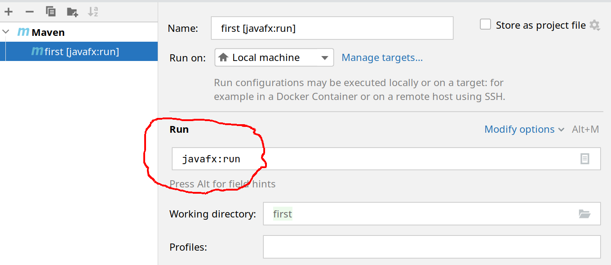
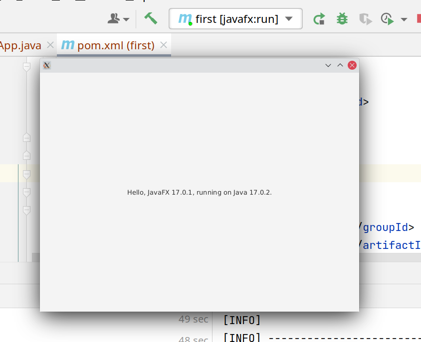

# 02.100 JavaFX Getting Started

## Java Version

You must have Java 11 or later for JavaFX in its modern form.  There was a version starting with Java 9.  I am using Java 17 in this tutorial.

## Setting up Intellij

Your must also have JavaFX enabled in IntelliJ.

See [https://www.jetbrains.com/help/idea/javafx.html#create-project](https://www.jetbrains.com/help/idea/javafx.html#create-project) for details.  Basically:

1. If you have a project open, you should be able to Open the "Files go to Settings or Preferences.  If no project is open, then use Ctrl+Alt+S to open the same dialog.
2. Select the "Plugins" option
3. Select the "Installed" tab.
4. At this point the IntelliJ documentation appears a little out-of-date.
   * You may need to search for "Javafx" in the search box.
   * At a minimum, select "JavaFX Runtime for Plugins" by JetBrains.
   * On Linux, I have the following selected.  It may vary a bit if you are using Windows or a Mac.
     * JavaFX Helper
     * JavaFX Tools
     * FXMLHelper
     * Dukescript Java Regex Tester -- This is totally unrelated to JavaFX.  But it looks like it could be very handy.  I am trying it out.  If it looks like I was trying to force Regex into a future assignment, it probably means I was playing with this plugin.  I love a good regex.

## Adding JavaFX

JavaFX is no longer always loaded in Java.  

Adapted from [https://openjfx.io/openjfx-docs/#maven](https://openjfx.io/openjfx-docs/#maven)

```bash
mvn archetype:generate \
        -DarchetypeGroupId=org.openjfx \
        -DarchetypeArtifactId=javafx-archetype-simple \
        -DarchetypeVersion=0.0.3 \
        -DgroupId="" \
        -DartifactId=first \
        -Dversion=1.0.0 \
        -Djavafx-version=17.0.1
```        
The above works in Linux.  It will probably work on a Mac as well.  The \ symbols mean the line is continued.  (Speculation follows:)  In Windows I think the ^ is used for line continuation.  So it should be possible to change them.  I tried faking this, but it has not been tested yet.  I also made a option 2 which is everything on one line.

```bash
mvn archetype:generate ^
        -DarchetypeGroupId=org.openjfx ^
        -DarchetypeArtifactId=javafx-archetype-simple ^
        -DarchetypeVersion=0.0.3 ^
        -DgroupId="" ^
        -DartifactId=first ^
        -Dversion=1.0.0 ^
        -Djavafx-version=17.0.1
```
One-liner.  Also has a different name:
```bash
mvn archetype:generate -DarchetypeGroupId=org.openjfx        -DarchetypeArtifactId=javafx-archetype-simple -DarchetypeVersion=0.0.3 -DgroupId="" -DartifactId=first -Dversion=1.0.0 -Djavafx-version=17.0.1
```     


```xml
    <plugin>
        <groupId>org.openjfx</groupId>
        <artifactId>javafx-maven-plugin</artifactId>
        <version>0.0.8</version>
        <configuration>
            <mainClass>HelloFX</mainClass>
        </configuration>
    </plugin>
```


I needed to add a runtime configuration. I picked a Maven configuration. All I added was on the "Run" line.  One of the options was javafx:run.  I picked that as a guess.  It worked.



I was rewarded with the following javafx app: 


